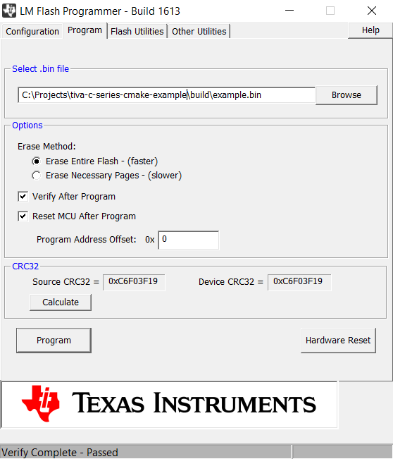
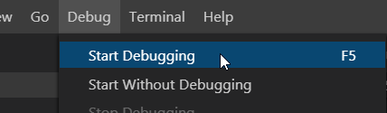
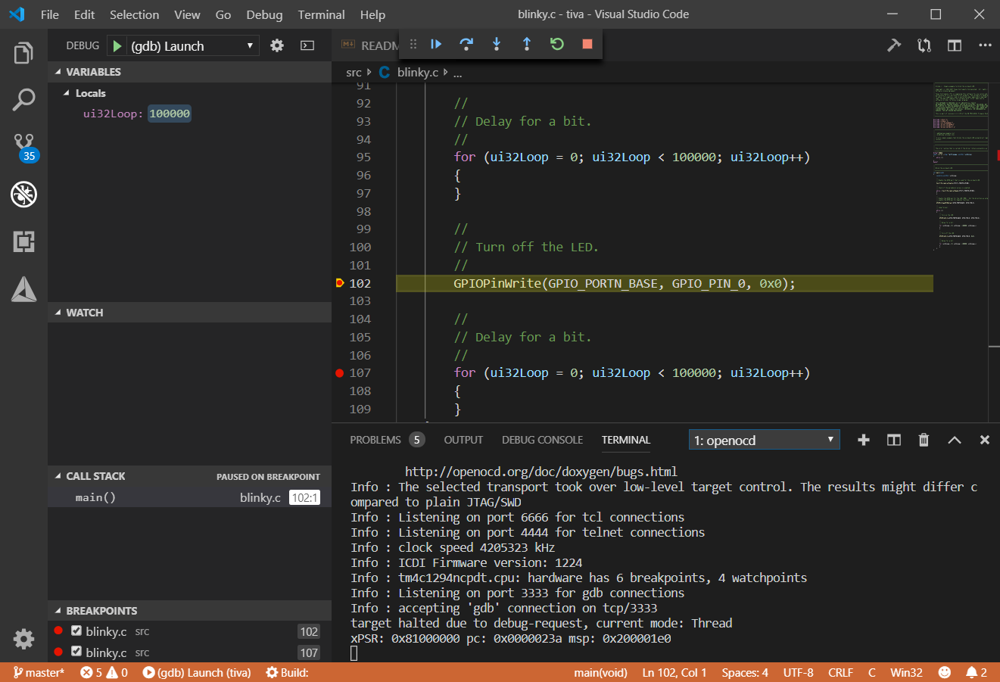
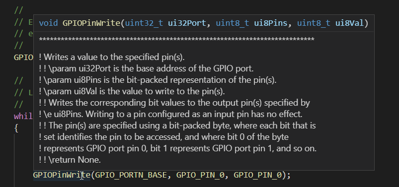
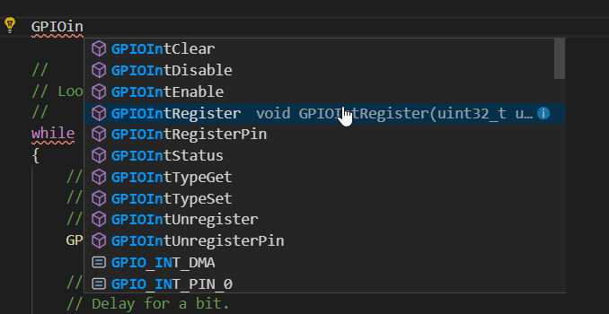

# Tiva C Series CMake Example Project

**This is Windows only!**

This is an example project for [Tiva C Series TM4C1294 board](http://www.ti.com/tool/EK-TM4C1294XL). This project uses [CMake](https://cmake.org/) to generate the build files and [OpenOCD](https://gnutoolchains.com/arm-eabi/openocd/) for connecting to the board's embedded debugger and enabling live debugging through Visual Studio Code. But, it should be easy to reconfigure the CMake script for other TM4C123x boards.

Yes, there is the [Code Composer Studio](http://www.ti.com/tool/CCSTUDIO) dedicated for Texas Instruments ARM boards. This project serves as an alternative to use Visual Studio Code instead (or anything supported by CMake).

## Requirements

* TivaWare C Series SDK - [Download here](http://software-dl.ti.com/tiva-c/SW-TM4C/latest/index_FDS.html) (Use the Complete solution!).
* Flash Programmer - [Download here](http://www.ti.com/tool/LMFLASHPROGRAMMER).
* ARM version of the GCC - [Download here](https://developer.arm.com/tools-and-software/open-source-software/developer-tools/gnu-toolchain/gnu-rm/downloads) (Comes with C11 and C++14).
* CMake - [Download here](https://cmake.org/download/).
* Visual Studio Code - [Download here](https://code.visualstudio.com/).
* OpenOCD (optional, for debugging) - [Download here](https://gnutoolchains.com/arm-eabi/openocd/).

If you are using [Chocolately package manager](https://chocolatey.org/), then you can install GCC via `choco install gcc-arm-embedded` as an administrator. That will install GCC 7.2.1 or newer.

## Compilation

Make sure that the `arm-none-eabi-gcc` (and other gcc executables) are in your system's PATH variable. If your terminal can't find these executables, the following cmake commands below will fail!

If you don't have `mingw32-make.exe` available on your system, you will need GNU Make for Windows. You can download it from [here](https://sourceforge.net/projects/gnuwin32/files/make/3.81/) or via chocolately as `choco install make`.

```bash
# Clone this repository
git clone https://github.com/matusnovak/tiva-c-series-cmake-example
cd tiva-c-series-cmake-example

# Create a build folder where all of the temporary files will be stored
mkdir build
cd build

# Configure the project
cmake -G "MinGW Makefiles" \
  -DCMAKE_MAKE_PROGRAM=make.exe \ # Or mingw32-make.exe
  -DCMAKE_BUILD_TYPE=Debug \
  -DCMAKE_TOOLCHAIN_FILE:PATH="../cmake/arm-none-eabi-toolchain.cmake" \
  -DTIVA_WARE_C_PATH=C:/ti/TivaWare_C_Series-2.1.4.178 \
  ..

# Expected output:
# -- Configuring done
# -- Generating done
# -- Build files have been written to: C:/Projects/tiva-c-series-cmake-example/build

# Building
cmake --build .

# Expected output:
# [ 33%] Building C object CMakeFiles/example.dir/src/blinky.c.obj
# [ 66%] Building C object CMakeFiles/example.dir/src/startup_gcc.c.obj
# [100%] Linking C executable example
# [100%] Built target example
```

Now you have `tiva-c-series-cmake-example/build/example.axf` and `tiva-c-series-cmake-example/build/example.bin` files. Launch the "LM Flasher Programmer" and upload the `example.bin` file. Screenshot:



Now you should see your board blinking.

## Debugging

Find the `tiva-c-series-cmake-example/.vscode/launch.json` file and check that the hardcoded path to `arm-none-eabi-gdb.exe` is valid, modify if needed. This is a sample debugging configuration for the latest Visual Studio Code at the time of writing, should work out of the box. Launch a terminal and run the following command:

```bash
openocd -f c:\ti\OpenOCD-20190715-0.10.0\share\openocd\scripts\board\ek-tm4c1294xl.cfg

# Expected output:
# Info : The selected transport took over low-level target control. The results might differ compared to plain JTAG/SWD
# Info : Listening on port 6666 for tcl connections
# Info : Listening on port 4444 for telnet connections
# Info : clock speed 4205323 kHz
# Info : ICDI Firmware version: 1224
# Info : tm4c1294ncpdt.cpu: hardware has 6 breakpoints, 4 watchpoints
# Info : Listening on port 3333 for gdb connections
```

You are now connected to the board. All you have to do now is to launch the debugger from Visual Studio Code. 



Your board should continue running the program. You can add breakpoints or even completely pause the program and see all of the local variables.



That's all, happy debugging!

## IntelliSense 

Visual Studio Code will try to lookup the headers such as `driverlib/gpio.h` in your program to offer code completion and other useful tools. To do that, it needs a `.vscode/c_cpp_properties.json` file. This project already comes with such file, but, you will have to double check that the path to the `TivaWare_C_Series` is valid. After that, you should be able to get tooltips if you hower over a function as seen below in the screenshot.



And code completion as well:



## F.A.Q

> How do I add libraries?

Inside of the `CMakeLists.txt` file, look up line `target_link_libraries(${PROJECT_NAME} PUBLIC ( ... )` and add your libraries here.

> How do I add header file directories?

Inside of the `CMakeLists.txt` file, look up line `target_include_directories(${PROJECT_NAME} PUBLIC ( ... )` and add path to your external header files here.

> How do I enable C++14 or C11?

It already is, inside of the `CMakeLists.txt` at line `set_property(TARGET ${PROJECT_NAME} PROPERTY CXX_STANDARD 14)`. 

> How do I add additional source files?

Add a file inside of the `src` directory, then rerun CMake as `cd build` and `cmake ..`. (You don't need to specify `-D...` if you are re-running cmake). CMake will automatically find them and will update its build files.

> Visual Studio Code cannot find header files, or code completion does not work.

Make sure that the `includePath` in `.vscode/c_cpp_properties.json` is valid and points to the Tiva C Series directory.

> How do I use other board?

That really depends on the board. You will have to modify the `target_compile_options` and `target_compile_definitions` inside of the `CMakeLists.txt` file. To get the correct compile options for the MCU, simply run a blinky example located in the examples folder of the `TivaWare_C_Series` folder you have downloaded from Texas Instruments. Run the example as `make -n` (a dry run) which will show you all of the commands that are needed.

For example, if using tm4c123gxl, your compile options are: `-mthumb -mcpu=cortex-m4 -mfpu=fpv4-sp-d16 -mfloat-abi=hard -ffunction-sections -fdata-sections -MD -Wall -pedantic` and definitions are: `-DPART_TM4C123GH6PM`.

You will also need to update the linker script! Search for the `blinky.ld` file.

## License

Files, `src/blinky.c`, `src/startup_gcc.c`, and `blinky.ld` are licensed by Texas Instruments Incorporated. See their license for details.

All other non Texas Instruments files such as `CMakeLists.txt`, `arm-none-eabi-toolchain.cmake`, `launch.json`, and this README is licensed under public domain, the "Unlicense".

```
This is free and unencumbered software released into the public domain.

Anyone is free to copy, modify, publish, use, compile, sell, or distribute this software, either in source code form or as a compiled binary, for any purpose, commercial or non-commercial, and by any means.

In jurisdictions that recognize copyright laws, the author or authors of this software dedicate any and all copyright interest in the software to the public domain. We make this dedication for the benefit of the public at large and to the detriment of our heirs and successors. We intend this dedication to be an overt act of relinquishment in perpetuity of all present and future rights to this software under copyright law.

THE SOFTWARE IS PROVIDED "AS IS", WITHOUT WARRANTY OF ANY KIND, EXPRESS OR IMPLIED, INCLUDING BUT NOT LIMITED TO THE WARRANTIES OF MERCHANTABILITY, FITNESS FOR A PARTICULAR PURPOSE AND NONINFRINGEMENT. IN NO EVENT SHALL THE AUTHORS BE LIABLE FOR ANY CLAIM, DAMAGES OR OTHER LIABILITY, WHETHER IN AN ACTION OF CONTRACT, TORT OR OTHERWISE, ARISING FROM, OUT OF OR IN CONNECTION WITH THE SOFTWARE OR THE USE OR OTHER DEALINGS IN THE SOFTWARE.

For more information, please refer to <http://unlicense.org/>
```
